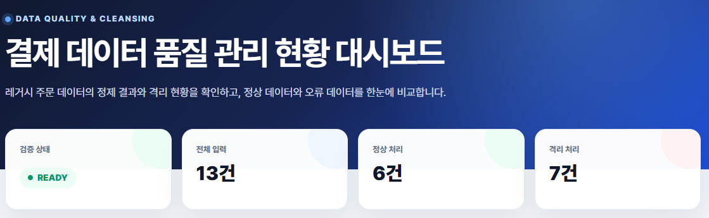

# Day 3 대시보드 요청 흐름

```
flowchart LR
    A["브라우저 -> GET /bookstore/day3/"]
    B["config/urls.py -> bookstore/"]
    C["bookstore/presentation/urls.py -> day3/"]
    D["views.py -> day3_dashboard(request)"]
    E["services.py -> Day 3 데이터와 context 생성"]
    F["day3_dashboard.html -> 템플릿 렌더링"]
    G["브라우저 응답 -> 정상 6 · 격리 7 · 전체 13"]

    A --> B --> C --> D --> E --> D --> F --> G
```

## 처리 과정

1. 브라우저가 `/bookstore/day3/` 주소로 GET 요청을 보낸다.
2. `config/urls.py`가 `bookstore/` 경로를 처리한다.
3. `bookstore/presentation/urls.py`가 `day3/` 요청을 `day3_dashboard`에 연결한다.
4. `day3_dashboard`는 서비스 함수에서 Day 3 context를 가져온다.
5. view가 context를 `day3_dashboard.html`에 전달한다.
6. 화면에 정상 6건, 격리 7건, 전체 13건이 출력된다.

## 실행 결과

- 정상 처리: 6건
- 격리 처리: 7건
- 전체 입력: 13건

