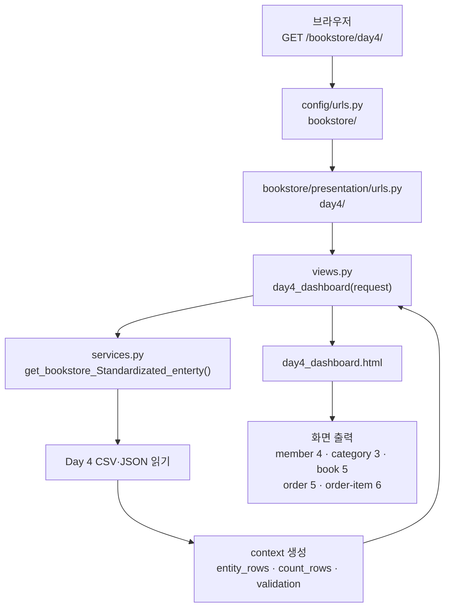
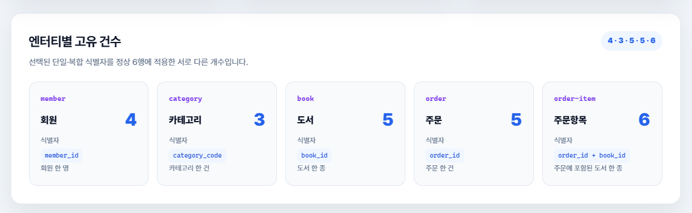

# Day 4 초급 미션: 대시보드 요청 흐름

## 1. 미션 목표

`/bookstore/day4/` 요청이 URL 설정, view, service를 거쳐
`day4_dashboard.html`로 전달되는 과정을 확인한다.

최종 화면에서 다음 다섯 엔터티의 실제 건수를 확인한다.

| 엔터티 | 실제 건수 |
|---|---:|
| member | 4 |
| category | 3 |
| book | 5 |
| order | 5 |
| order-item | 6 |

## 2. 요청 처리 흐름

## 3. 파일별 역할

| 파일 | 역할 |
|---|---|
| `config/urls.py` | `/bookstore/` 경로를 bookstore URL 설정에 연결한다 |
| `bookstore/presentation/urls.py` | `day4/` 요청을 `day4_dashboard`에 연결한다 |
| `bookstore/presentation/views.py` | 서비스에서 context를 받아 템플릿에 전달한다 |
| `bookstore/service/services.py` | Day 4 파일을 읽고 엔터티별 고유 건수를 계산한다 |
| `bookstore/templates/day4_dashboard.html` | `count_rows`를 다섯 엔터티 카드로 출력한다 |

## 4. 엔터티별 계산 기준

| 엔터티 | 선택 식별자 | 실제 건수 |
|---|---|---:|
| member | `member_id` | 4 |
| category | `category_code` | 3 |
| book | `book_id` | 5 |
| order | `order_id` | 5 |
| order-item | `(order_id, book_id)` | 6 |

## 5. 화면 캡처

