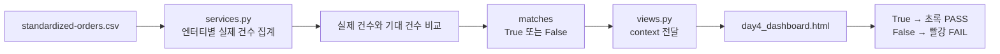

# Day 4 중급 미션: 엔터티 건수 검증 결과 표시

## 1. 미션 목표

Python 서비스에서 엔터티별 실제 건수와 기대 건수를 비교해 `matches`를 생성하고, template에서 다음 규칙으로 검증 결과를 표시한다.

- `matches == True`: 초록색 `PASS`
- `matches == False`: 빨간색 `FAIL`

완료를 위해 Python 집계와 화면 표현의 역할을 분리한다.

## 2. 처리 흐름



## 3. 수정 파일

다음 두 파일을 수정한다.

```text
bookstore/service/services.py
bookstore/templates/day4_dashboard.html
```

`urls.py`와 `views.py`는 기존 연결을 그대로 사용한다.

## 4. services.py에서 기대 건수 정의

Day 4 서비스 함수의 `entity_order` 아래에 기대 건수를 정의한다.

```python
entity_order = [
    "member",
    "category",
    "book",
    "order",
    "order-item",
]

expected_counts = {
    "member": 4,
    "category": 3,
    "book": 5,
    "order": 5,
    "order-item": 6,
}
```

## 5. services.py에서 matches 계산

식별자 기준으로 실제 고유 건수를 계산한 다음 기대 건수와 비교한다.

```python
actual_count = len(distinct_keys)
expected_count = expected_counts[entity_id]

count_rows.append(
    {
        "entity_id": entity_id,
        "logical_name": entity["logical_name"],
        "identifier": " + ".join(identifier_columns),
        "grain": entity["grain"],
        "count": actual_count,
        "expected_count": expected_count,
        "matches": actual_count == expected_count,
    }
)
```

실제 건수와 기대 건수가 같으면 다음과 같은 값이 만들어진다.

```python
{
    "entity_id": "member",
    "count": 4,
    "expected_count": 4,
    "matches": True,
}
```

건수가 다르면 `matches`는 `False`가 된다.

```python
{
    "entity_id": "member",
    "count": 3,
    "expected_count": 4,
    "matches": False,
}
```

## 6. template에서 PASS와 FAIL 표현

`day4_dashboard.html`의 `` 반복문 안에 다음 내용을 추가한다.

```django
<div class="count-validation">
  <span>
    기대 {{ row.expected_count }}건
  </span>

  <span
    class="
      check-chip
      
        check-pass
      
        check-fail
      
    "
  >
    
      PASS
    
      FAIL
    
  </span>
</div>
```

template은 실제 건수를 다시 계산하지 않고 Python에서 전달받은 `row.matches`만 판단한다.

## 7. 표시 영역 CSS

`day4_dashboard.html`의 `<style>` 안에 다음 스타일을 추가한다.

```css
.count-validation {
  display: flex;
  align-items: center;
  justify-content: space-between;
  gap: 10px;
  margin-top: 13px;
  padding-top: 12px;
  color: var(--muted);
  border-top: 1px solid var(--border);
  font-size: 12px;
  font-weight: 800;
}
```

기존 Day 4 템플릿의 다음 클래스를 PASS와 FAIL 표시에 재사용한다.

```css
.check-pass {
  color: var(--green);
  background: var(--green-soft);
}

.check-fail {
  color: var(--red);
  background: var(--red-soft);
}
```

## 8. 계층별 역할 구분

| 계층 | 담당 역할 |
|---|---|
| `services.py` | CSV에서 엔터티별 실제 고유 건수를 집계한다. |
| `services.py` | 실제 건수와 기대 건수를 비교한다. |
| `services.py` | 비교 결과를 `matches=True/False`로 만든다. |
| `views.py` | 서비스에서 받은 context를 template에 전달한다. |
| `day4_dashboard.html` | `matches`에 따라 PASS 또는 FAIL 문구를 선택한다. |
| `day4_dashboard.html` | PASS는 초록색, FAIL은 빨간색으로 표현한다. |

Python 코드에는 HTML이나 색상 정보를 넣지 않고, template에는 엔터티 건수 계산 로직을 넣지 않는다.

## 9. 역할 분리 설명

Python 서비스는 `standardized-orders.csv`에서 선택 식별자별 고유 건수를 집계하고, 고정 fixture의 기대 건수와 비교하여 `matches`라는 Boolean 값을 생성한다. Template은 건수를 다시 계산하지 않고 전달받은 `matches`가 참이면 초록색 `PASS`, 거짓이면 빨간색 `FAIL`을 표시한다. 따라서 데이터 집계와 판정은 Python이 담당하고, 문구와 색상 같은 화면 표현은 template이 담당한다.

## 10. 실행 및 확인

프로젝트 루트에서 Django 검사를 실행한다.

```powershell
cd C:\Chapter2\monorepo
python manage.py check
```

개발 서버를 실행한다.

```powershell
python manage.py runserver
```

다음 주소로 접속한다.

```text
http://127.0.0.1:8000/bookstore/day4/
```

현재 고정 데이터가 기대 건수와 모두 일치하면 다음 결과가 표시되어야 한다.

| 엔터티 | 실제 | 기대 | 결과 |
|---|---:|---:|---|
| member | 4 | 4 | PASS |
| category | 3 | 3 | PASS |
| book | 5 | 5 | PASS |
| order | 5 | 5 | PASS |
| order-item | 6 | 6 | PASS |

## 11. 완료 기준

- `count_rows`의 각 행에 `expected_count`가 존재한다.
- `count_rows`의 각 행에 `matches`가 존재한다.
- template이 ``를 사용한다.
- 참이면 초록색 `PASS`가 표시된다.
- 거짓이면 빨간색 `FAIL`이 표시된다.
- Python 집계와 template 표현의 역할을 문서에서 구분해 설명한다.

위 조건을 모두 만족하면 Day 4 중급 미션 완료이다.
