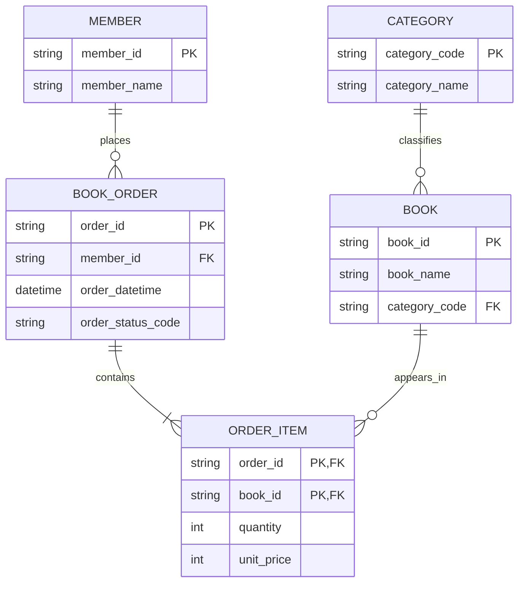

# 온라인 서점 정규화 모델

## 모델 목적

주문 트랜잭션의 중복과 삽입·갱신·삭제 이상을 줄이는 3NF 쓰기 모델을 정의한다.

## 안정 엔터티 ID

- stable_id: member
- stable_id: category
- stable_id: book
- stable_id: order
- stable_id: order-item

## 원천 grain

`standardized-orders.csv`의 한 행은 주문 한 건에 포함된 도서 한 종이다.

## 함수적 종속

- `order_id → member_id, order_datetime, order_status_code`
- `member_id → member_name`
- `book_id → book_name, category_code`
- `category_code → category_name`
- `(order_id, book_id) → quantity, unit_price`

## 정규화 기록

### 1NF

- 판정: 통과
- 이동: 다중값 도서 목록을 주문항목별 개별 행으로 펼친다.
- 현재 입력: Day 3에서 이미 한 주문항목이 한 행이므로 추가 분해하지 않는다.

### 2NF

- 주문 ID에만 의존하는 `member_id`, `member_name`, `order_datetime`, `order_status_code`를 주문 묶음으로 옮긴다.
- 도서 ID에만 의존하는 `book_name`, `category_code`, `category_name`을 도서 묶음으로 옮긴다.
- 복합키 전체에 의존하는 `quantity`, `unit_price`는 주문항목에 남긴다.

### 3NF

- `order_id → member_id → member_name`을 제거하기 위해 회원을 분리한다.
- `book_id → category_code → category_name`을 제거하기 위해 카테고리를 분리한다.
- 주문에는 `member_id` FK, 도서에는 `category_code` FK만 남긴다.

## 최종 엔터티와 속성

| 안정 ID | 물리 테이블 | 속성 | 키 |
| --- | --- | --- | --- |
| `member` | `member` | `member_id`, `member_name` | `member_id` PK |
| `category` | `category` | `category_code`, `category_name` | `category_code` PK |
| `book` | `book` | `book_id`, `book_name`, `category_code` | `book_id` PK, `category_code` FK |
| `order` | `book_order` | `order_id`, `member_id`, `order_datetime`, `order_status_code` | `order_id` PK, `member_id` FK |
| `order-item` | `order_item` | `order_id`, `book_id`, `quantity`, `unit_price` | `(order_id, book_id)` PK, 두 컬럼 모두 FK |

## ERD

## 도메인 적용

- 모든 ID·코드는 빈 문자열을 허용하지 않는다.
- 이름 길이는 Day 2의 이름 도메인을 따른다.
- `order_datetime`은 ISO-8601 주문 시점이다.
- `order_status_code`는 Day 2의 허용 코드만 사용한다.
- `quantity`는 1 이상 999 이하의 정수다.
- `unit_price`는 0 이상이고 소수 둘째 자리까지 표현하는 주문 당시 가격이다.

## 범위 경계

- 이 모델은 트랜잭션을 정확히 쓰고 수정하기 위한 write model이다.
- 추천 조회를 위한 넓은 표, 집계, Feature Store 구조는 Day 6에서 별도 read model 후보로 설계한다.
- Day 6에서도 이 정규화 모델을 근거 없이 없애거나 덮어쓰지 않는다.